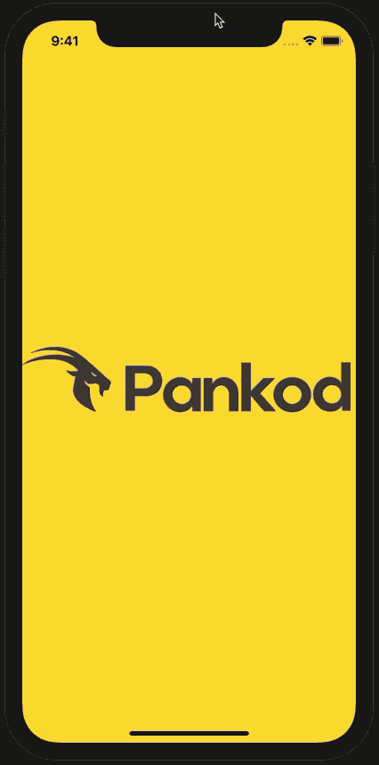

# React Native Photo Gallery View

** yazılacak

<div align="center">

[](https://www.npmjs.com/package/react-native-photo-gallery-view)
[](https://www.npmjs.com/package/react-native-photo-gallery-view)
[](https://david-dm.org/pankod/react-native-photo-gallery-view)
[](https://david-dm.org/pankod/react-native-photo-gallery-view?type=dev)
[](https://travis-ci.com/pankod/react-native-photo-gallery-view)

</div>
<br/>

<div align="center">
 
 
</div>

<br/>


<br/>
<div align="center"> <h3>React Native Photo Gallery View<h3></div>
<div align="center">React Native Module to select and view for photos gallery</div>
<div align="center">
  <sub>Created by <a href="https://www.pankod.com">Pankod</a></sub>
</div>
<br/>


## Stores Supported:
| **Apple App Store**  |   **Google Play**  |  
:--------------------------------------------------------------------------------------------------------------------------------------: | :-------------------------------------------------------------------------------------------------------------------------------------: | 
| **✓** | **✓** | 
|  |  | 


## Getting started
```
$ npm install react-native-photo-gallery-view --save
```

or

```
$ yarn add react-native-photo-gallery-view
```

<!-- ## Usage -->


## Example
```javascript
import React, { Component } from 'react';
import { StyleSheet, SafeAreaView, TouchableOpacity, Text, Button, View, ActivityIndicator, Image } from 'react-native';
import RNGallery from 'react-native-photo-gallery-view';

const list = require('./data.json');

export default class example extends Component {

	onBack(): void {
		console.warn('back key pressed...');
	}
	
	render() {
		return (
		<SafeAreaView style={{ flex: 1 }}>
			<RNGallery
				mediaList={this.list}
				onBack={this.onBack.bind(this)}
				customTopBarStyle={{
				height: 50
				}}
				gridSize={3}
				renderStickyFooter={(height: number) => this.renderStickyFooter(height)}
				renderDetailButtons={(media: object) => this.renderDetailButtons(media)}
				onSelectionChanged={(media, index) => this.onSelectionChanged(media, index)}
				displaySelectionButtons={false}
				stickyFooter={true}
				// customTopBarBackButton={(action) => <Button onPress={() => action()} title={"Back"} />}
				// customMainTitle={(totalImages) => <Text>{totalImages} Photos</Text>}
				// customSelectedTitle={(totalSelected) => <Text>{totalSelected} selected photos...</Text>}
				// customDetailTitle={(totalImages, photoIndex) => <Text>{photoIndex} of {totalImages}</Text>}
				// customCheckedView={() => (
				// 	<View style={{ position: 'absolute', right: 10, top: 10, zIndex: 2 }}>
				// 		<Text>Checked</Text>
				// 	</View>
				// )}
				// customImageComponent={(media, index) =>
				// 	<Image
				// 		source={{ uri: media.photo }}
				// 		resizeMode={"contain"}
				// 		style={{ flex: 1, margin: 5, borderRadius: 20 }}
				// 	/>
				// }
				// customThumbnailImage={(media, index) =>
				// 	<Image
				// 		source={{ uri: media.thumb }}
				// 		style={{ flex: 1, borderRadius: 10 }}
				// 	/>
				// }
				renderCustomState={(media, index) => this.renderCustomState(media)}
			/>
		</SafeAreaView>
		);

		renderCustomState(media: object): JSX.Element {
		if (media.state !== 'Approved') {
			return (
				<View style={{
					alignItems: 'center',
					backgroundColor: 'white',
					bottom: 0,
					justifyContent: 'center',
					left: 0,
					opacity: 0.5,
					position: 'absolute',
					right: 0,
					top: 0,
					zIndex: 1
				}}>
					{media.state === 'Loading' &&
						<ActivityIndicator size={"large"} />
					}
					{media.state !== 'Loading' &&
						<Text style={{ color: media.state === 'Deleted' ? 'red' : 'black' }}>
							{media.state}
						</Text>}
				</View>
			);
		}

		return null;
	}

	onSelectionChanged(media: object, index: number): void {
		console.log(media, index);
	}

	renderStickyFooter(height: number): JSX.Element {
		return (
			<Button title={"Upload"} onPress={() => console.log("render stick footer 1. element", height)} />
		)
	}

	renderDetailButtons(media: object): JSX.Element {
		return (
			<React.Fragment>
				<Button title={"Delete"} onPress={() => console.log(media)} />
				<Button title={"Set as default"} onPress={() => console.log(media)} />
			</React.Fragment>
		)
	}
}

const styles = StyleSheet.create({
	btn: {
		justifyContent: 'space-between',
		flexDirection: 'row',
		padding: 5
	},
	green: {
		backgroundColor: 'green'
	},
	yellow: {
		backgroundColor: 'yellow'
	}
});

```

<br/>

## Options
<br/>

| Properties | Type | Description | Default |
|------------|-------------------------------------|-------------|----------------------------------------------------------------|		
| **mediaList** <br> **required* | `array`  | Array of media items | `"[{caption, id, photo, state, thumb]"` | 
| **displaySelectionButtons** | `boolean`  | On/off selection mode | `"false"` | 
| **stickyFooter** | `boolean`  | On/off for renderStickyFooter custom component | `"true"` | 
| **customTopBarStyle**   | `style` | Custom style for top bar |  | 
| **gridSize**   | `number` | How many media items showing side by side | `"3"` | 
| **onBack**   | `Function` |  Fired when the back key is pressed | |
| **renderStickyFooter**   | `Function` | Custom component for selection mode in footer  | |
| **renderDetailButtons**   | `Function` | Custom component for view mode in footer  | |
| **renderCustomState**   | `Function` | Custom component for viewing each media item overlay in main scene | `"(media, index) => <View .../>"` |
| **customTopBarBackButton**   | `Function` | Custom component for back button in top bar  |  |
| **customMainTitle**   | `Function` | Custom component for main scene title in top bar  | `"(totalImages) => <Text>{totalImages} Photos</Text>"` |
| **customCheckedView**   | `Function` | Custom component for selected view when media item selected  |  |
| **customImageComponent**   | `Function` | Custom component for view media item  | `"(media, index) => <Image .../>"` |
| **customThumbnailImage**   | `Function` | Custom component for thumbnail media item in main scene | `"(media, index) => <Image .../>"` |
| **customSelectedTitle**   | `Function` | Custom component for main scene title when selected mode in top bar  | `"(totalSelected) => <Text>{totalSelected} selected photos...</Text>"` |
| **customDetailTitle**   | `Function` | Custom component for detail scene title in top bar  | `"(totalImages, photoIndex) => <Text>{photoIndex} of {totalImages}</Text>"` |
| **onSelectionChanged** <br> **required* | `Function`  | Returns selected item object | `"{caption, id, photo, state, thumb}"` | 


#### Releases

- 1.0.0 - Initial release


